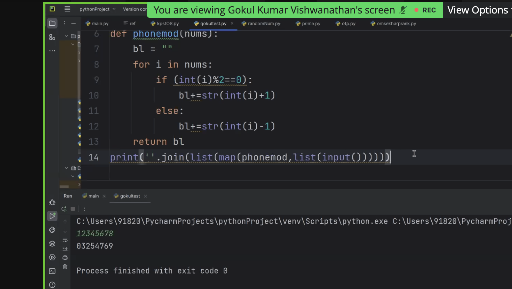
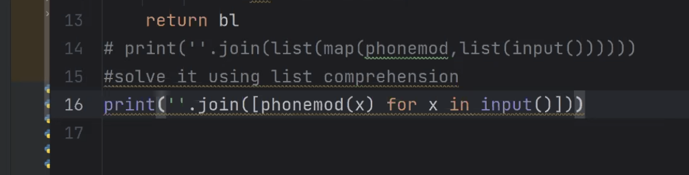
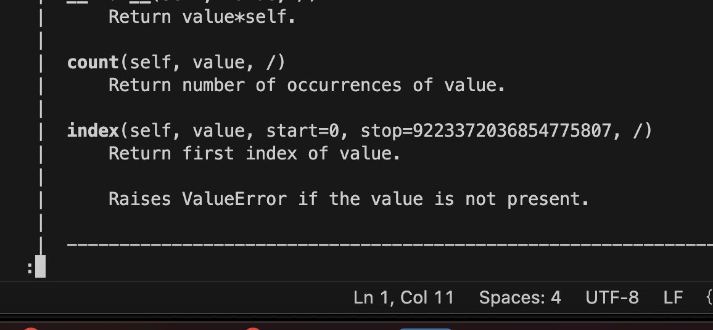
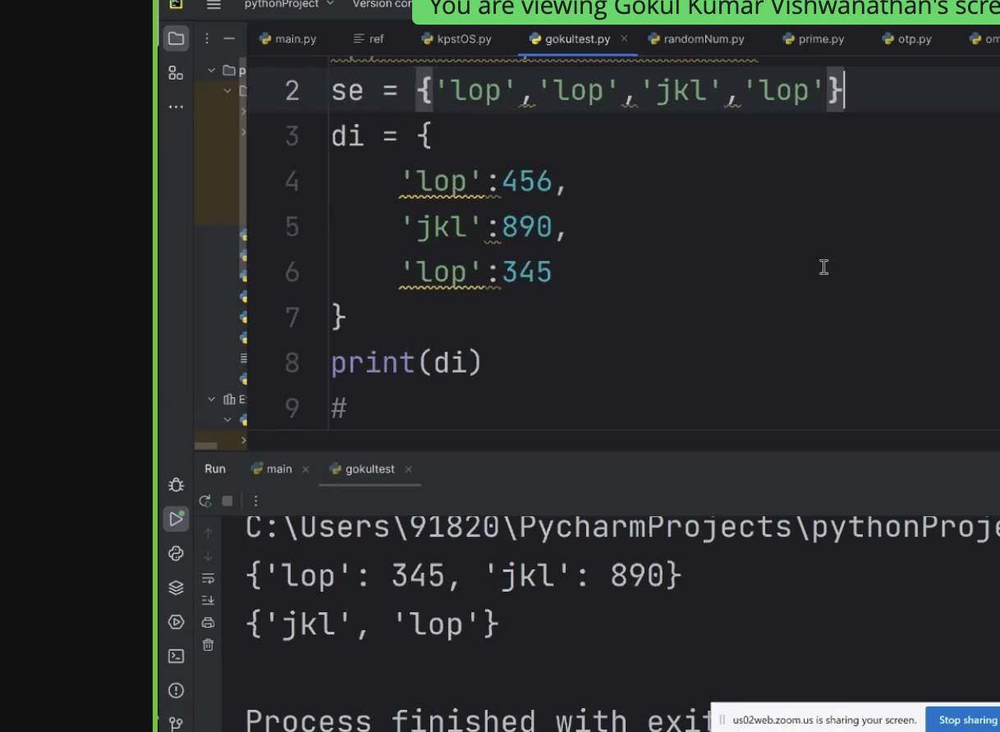

- join in python for strings

 

- same using list comprehension

- tuple is immutable
- we cant append or remove elements from tuple
- if we want to append or remove elements from tuple we need to convert it to list and then convert it back to tuple

```
#take your phone number as input # map it to the 
# next or previous int according to the filter value #
# if it is even then +1 and if it is odd -1

x="8208117943"
y=""
for i in range(len(x)):
    if int(x[i])%2==0:
        y+=str(int(x[i])+1)
    else:
        y+=str(int(x[i])-1)
print(y)


# USING map and filter

x="8208117943"
y=""
def map_func(x):
    if int(x)%2==0:
        return str(int(x)+1)
    else:
        return str(int(x)-1)

print("".join(list(map(map_func,x))))

# USING map and filter

x="8208117943"
y=""
def filter_func(x):
    if int(x)%2==0:
        return True
    else:
        return False
    
print("".join(list(filter(filter_func,x))))

```

- implicit vs explicit type conversion

- implicit type conversion is done by python itself
    - int to float, float to int, int to string, string to int, float to string, string to float
    
- adding elements to tuple
```
x=(1,2,3)
x=list(x)
x.append(9)
print(tuple(x))
```


- tuple has only 2 methods
    - count
    - index

- application of tuple:
    - when we want to store data which is not going to change like days of week, months of year, etc
    

## set and dictionary
- set is unordered collection of unique elements
- set is mutable

- union, intersection, difference, symmetric difference
    - union
        - eg x={1,2,3} y={3,4,5} x.union(y) or x|y
        - 
- dictionary is unordered collection of key value pairs
- get vs [] in dictionary
    - get returns None if key is not present
    - [] throws error if key is not present

- dictionary methods
    - keys , returns all keys
        - x.keys() or list(x.keys())
    - values, returns all values
        - x.values() or list(x.values())
        
    - items, returns all key value pairs
    - get, returns value of the key
    - pop , removes the key value pair and returns the value
    - popitem , removes the last key value pair and returns the key value pair
    - clear, clears the dictionary
    - update, updates the dictionary with the given dictionary
    - copy, copies the dictionary, shallow copy
    - fromkeys , creates a dictionary with the given keys and values
    - setdefault , returns the value of the key if present else sets the key with the given value and returns the value
        - x.setdefault("name","sachin")
            - if name is present then it returns the value of name
            - if name is not present then it sets the name with the value sachin and returns the value sachin
- set will not allow duplicate elements
    - set will sort the integers by default in ascending order, but not strings


    - see the output, the last occurence will be take and not first occurence

```
# take input from user as element of dictionaries # in a user friendly way and store it as di # and sort the dictionary with its key pairs # and sort the same dictionary with its value pairs # provided the condition is that the entered values # are integers
```

```
# take input from user as element of dictionaries 
# in a user friendly way and store it as di 
# and sort the dictionary with its key pairs 
# and sort the same dictionary with its value pairs 
# provided the condition is that the entered values 
# are integers

x={2:100,3:50,1:200,4:25,5:10}

# take input from user as element of dictionaries

x={}
while True:
    a=input("enter the key")
    b=input("enter the value")
    if a.isnumeric() and b.isnumeric():
        x[int(a)]=int(b)
    else:
        print("enter the numeric value only, im exiting")
        break
# sort the dictionary with its key pairs

print(sorted(x.items()))

# sort the same dictionary with its value pairs

print(sorted(x.items(),key=lambda x:x[1]))
```

- learn lambda functions

- note : set will  order the integers by default in ascending order, but not strings
    - it will sort the float values also

- Python programs are generally expected to run slower than Java programs, but they also take much less time to develop. Python programs are typically 3-5 times shorter than equivalent Java programs. This difference can be attributed to Python's built-in high-level data types and its dynamic typing. For example, a Python programmer wastes no time declaring the types of arguments or variables, and Python's powerful polymorphic list and dictionary types, for which rich syntactic support is built straight into the language, find a use in almost every Python program. Because of the run-time typing, Python's run time must work harder than Java's. For example, when evaluating the expression a+b, it must first inspect the objects a and b to find out their type, which is not known at compile time. It then invokes the appropriate addition operation, which may be an overloaded user-defined method. Java, on the other hand, can perform an efficient integer or floating point addition, but requires variable declarations for

- https://www.python.org/doc/essays/comparisons/#:~:text=Python%20programs%20are%20generally%20expected,types%20and%20its%20dynamic%20typing.


- 
```
versioncontrol = [ { 'name':['gokul','divansh','suraj'], 'version':'1.2.1', 'fixedWhat':['bug fixes','updation','x','y'], 'donebywhom':[['x','y','z',{'main':['bug fixes']}], ['y','z'],{'main':['updation']}] }, { 'name':['gokul','pooja','suraj'], 'version':'1.2.1', 'fixedWhat':['bug fixes','updation','x','y'], 'donebywhom':[['x','y','z',{'|||||||bug fixes'],{'main':['bug fixes','updation']}] } ]
```