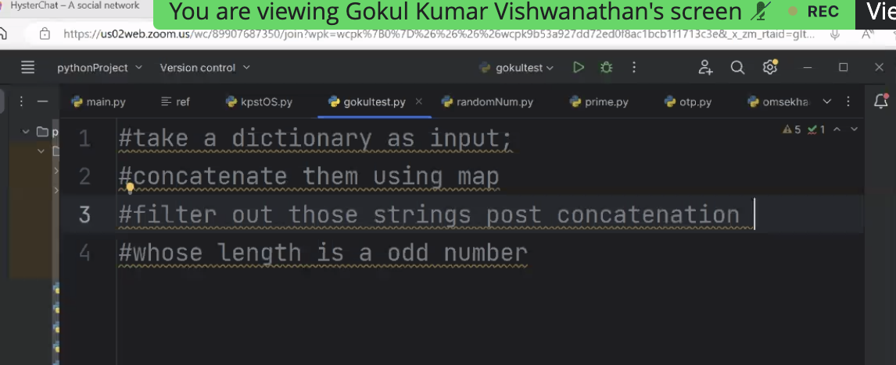
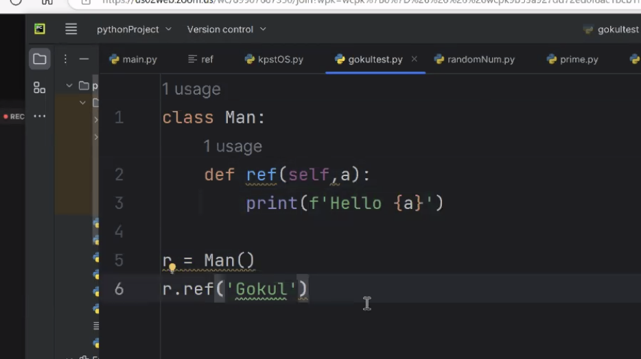

```
#take a dictionary as input; 
#concatenate them using map 
#filter out those strings post concatenation 
#whose length is a odd number

# concatenate the key and values of the dictionary,
# filter out those strings whose length is odd

x={"ab":"ef1","b":"c","ca":"aaa"}

def key_val_merge(x):
    y=[]
    for i in x:
        y.append(i+x[i])
    return y


def concat(x):
    y=""
    for i in x:
        y+=i
    return y

def odd(x):
    if len(x)%2==0:
        return False
    else:
        return True

print(list(filter(odd,map(concat,key_val_merge(x)))))
```
Amit solution:
```
d = {}

 

for i in range(3):

    key = input("Key: ")

    value = input("Value: ")

 

    d[key] = value

 

mapped_result = map(lambda kv: kv[0]+kv[1], d.items())

 

filtered_result = filter(lambda x: len(x)%2 != 0, mapped_result)

 

Lis = list(filtered_result)

 

print(Lis)
```
Amarnath solution:
```
dict1 = {}

for i in range(3):

    a = input("Enter string: ")

    b = input("Enter string: ")

    dict1[a] = b

lr = list(filter(lambda x: len(x) % 2 != 0, map(lambda k, v: k + v, dict1.keys(), dict1.values())))

print(*lr)
```
Gokul solution:
```
di = {}
numOfEle = int(input()) 
for i in range(numOfEle): 
    key = input() 
    value = input('value') 
    di[key] = value 
keyslist = list(di.keys()) 
valueslist = list(di.values()) 
def mapper (a,b): 
    return a+b 
def fil(n): 
    return len(n)%2!=0 
print(list(filter(fil,list(map(mapper,keyslist,valueslist)))))
```


self means instance of the class

```

#write a code to create a word class that takes 3 parameters as contructors 
#all the three parameters are strings 
#you are supposed to create 3 functions inside the same word class 
#the first function will remove all thevowels and give you the output
 #second one will replace vowels with star 
#third one will replace consonants with star

class Word:
    def __init__(self,a,b,c):
        self.a=a
        self.b=b
        self.c=c
    
    def remove_vowels(self):
        vowels='aeiou'
        for i in vowels:
            self.a=self.a.replace(i,"")
            self.b=self.b.replace(i,"")
            self.c=self.c.replace(i,"")
        print(self.a,self.b,self.c)

    def replace_vowels(self):
        vowels='aeiou'
        for i in vowels:
            self.a=self.a.replace(i,"*")
            self.b=self.b.replace(i,"*")
            self.c=self.c.replace(i,"*")
        print(self.a,self.b,self.c)

    def replace_consonants(self):
        cons='bcdfghjklmnpqrstvwxyz'
        for i  in cons :
            self.a=self.a.replace(i,"*")
            self.b=self.b.replace(i,"*")
            self.c=self.c.replace(i,"*")
        print(self.a,self.b,self.c)

x=Word("apple","orange","mango")
x.remove_vowels()
x=Word("apple","orange","mango")
x.replace_vowels()
x=Word("apple","orange","mango")
x.replace_consonants()
```

amit's solution

```
class WordClass():

    def __init__(self, s1, s2, s3):

        self.s1 = s1.lower()

        self.s2 = s2.lower()

        self.s3 = s2.lower()

        self.vowels = 'aeiou'

 

    def remove_vowels(self, s):

        temp = list(filter(lambda x: x not in self.vowels, s))

        return ''.join(temp)

 

    def replace_vowels(self, s):

        return ''.join('*' if i in self.vowels else i for i in s)

 

    def replace_consonant(self, s):

        return ''.join('*' if i not in self.vowels else i for i in s)

        

 

c = WordClass('amit', 'vikram', 'raj')

 

print(c.remove_vowels(c.s1))

print(c.replace_vowels(c.s2))

print(c.replace_consonant(c.s3))
```

hemalatha solution

```
class word:

  def init(self, inputstr, vowels,starchar):

    self.inputstr = inputstr

    self.vowels = vowels

    self.starchar = starchar

def removeallvowel(self):

    for i in range(len(self.inputstr)):

    if self.inputstr[i] not in vowels:

        result = result + string[i]

    return result

def replacevowelwithstar(self):

    for i in range(len(self.inputstr)):

    if self.inputstr[i] not in self.vowels:

        result = result + string[i]

    elsif self.inputstr[i]  in self.vowels:

	result = result +self.starchar

    return result

def replaceconsonantwithstar(self):

    for i in range(len(self.inputstr)):

    if self.inputstr[i] not in self.vowels:

        result = result +self.starchar

    elsif self.inputstr[i]  in self.vowels:

	result = result + string[i]

    return result

p1 = word("Hemalatha", 'a,e,i,o,u,A,E,I,O,U','*')

p1.removeallvowel()

p1.replacevowelwithstar()

p1.replaceconsonantwithstar()
```
