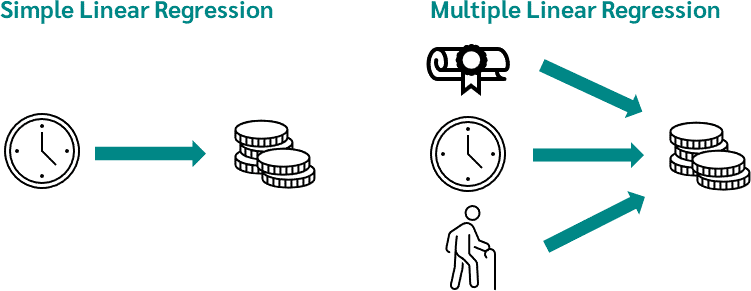

- https://docs.google.com/spreadsheets/d/1_uxTmmM430q4SHWYHMw6Dxo7y_-Wn07EpvegEczyEBc/edit#gid=1218172712

- this will  act as a glossary for all the terminologies and Algorithms we are gonna discuss in the classes

## Regression Analysis
  - What is Regression Analysis?
    - Regression analysis is a form of predictive modelling technique which investigates the relationship between a dependent (target) and independent variable (s) (predictor). This technique is used for forecasting, time series modelling and finding the causal effect relationship between the variables.
    - https://en.wikipedia.org/wiki/Regression_analysis
    - The most common form of regression analysis is linear regression, in which one finds the line (or a more complex linear combination) that most closely fits the data according to a specific mathematical criterion.
    - In short 
      - Regression analysis is a statistical method used for the elimination of a relationship between a dependent variable and an independent variable.
  - What is simple and Multiple Linear Regression?
    - in simple regression 
      - given x predict y
    - in multiple regression
      - given x1,x2,x3,x4 predict y
     
    - 
  - What is Assumptions and Model e