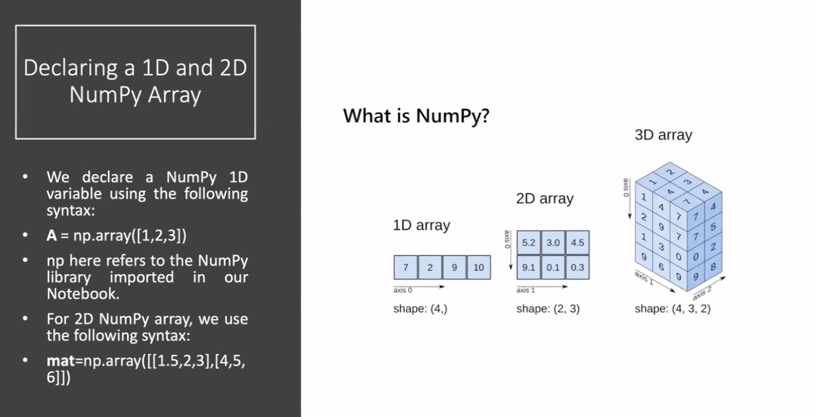
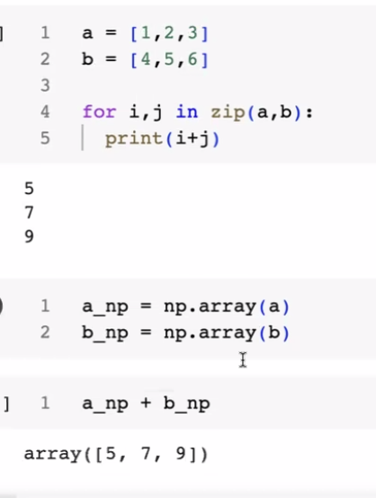
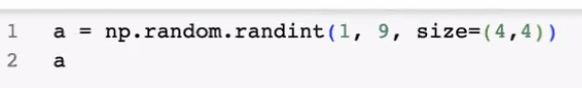

array
    - jax
    - pytorch
    - tensorflow
    - keras

- nmpy cannot do backpropagation
- pytorch can do backpropagation

- pytorch is a framework
  - a framework is a collection of libraries


- fundamental package for scientific computing with python

# numpy
- what it does?
    - deal with matrics
    - mathematical operations on arrays
    - feaetures for maths operations



- ppython lsit can have different data types
- numpy array can have only one data type


- numpy is int32 by default
- list is int64 by default





- difference between numpy and pandas
    - numpy is for mathematical operations
    - pandas is for data analysis


```
arr=np.random.rand(1000000000)
l=list(arr)
torch_arr=torch.tensor(arr)
a=tf.constant(arr,dtype=tf.float64)
jax=jnp.array(arr)
```

# normal image
- 1000*720*3*1000
- 1000 is the number of images
- 720 is the height
- 3 is the number of channels
- 1000 is the width 


- % means a magic function
- %timeit is a magic function


- torch can be done in two ways
    - gpu 
    - cpu

- tf 1.5ms

- jax 700 micro secs

- torch gpu 

py- 6secs
np- 256ms
torch 150 ms
jnp - 761 micro secs



a=np.random.randint(1,9,size=(4,4))
- get max pool

- to get max pool , with numpy, 


# array generation
a=np.zeros((3,3))
b=np.ones((3,3),dtype=np.int32)
c=np.full((3,3),5) - matrix filled with 5
d=np.full_like(a,4) - matrix filled with 4
    - the d matrix will be of the same shape as a with all values as 4

e=np.random.rand(3,3) - random values between 0 and 1
f=np.random.randint(1,9,size=(3,3)) - random values between 1 and 9
g=np.identity(3) - identity matrix
h=np.eye(3,3) - identity matrix
i=np.repeat(1,3) - repeat 1 three times
j np.repeat([1,2,3],3) - repeat 1,2,3 three times


