# Data science life cycle (in depth)

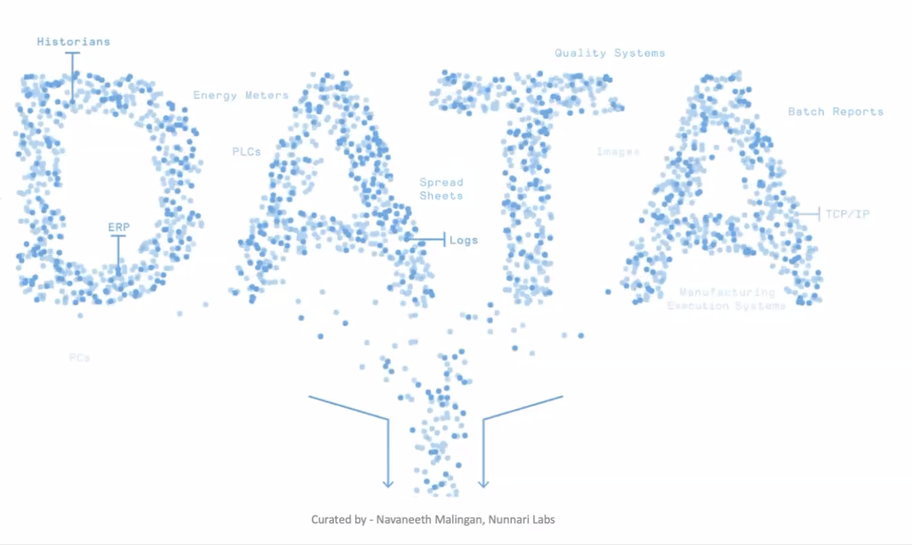

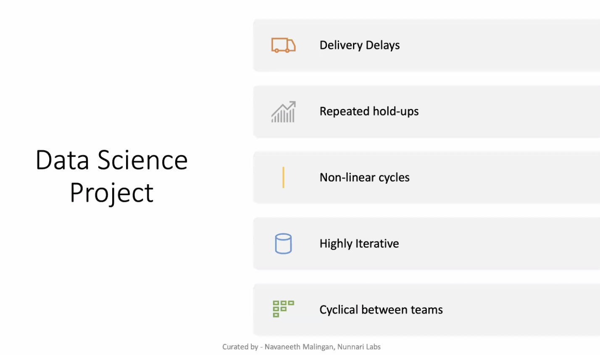

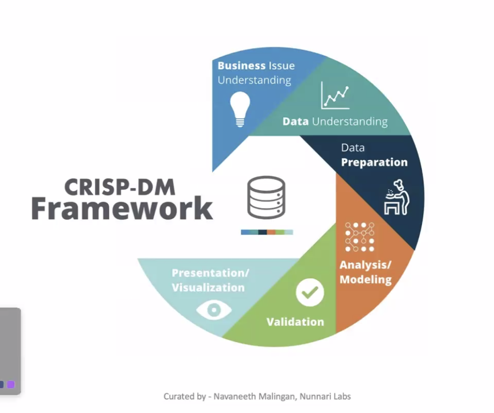

- Crisp DM Framework(6 phases)
    - Business understanding
    - Data understanding
    - preparation
        - the above three are mostly 
            - understanding
            - visualization
            - cleaning
            - data engineering
    - analysis modeling(4th phase)
        - focus on model building
    - validation
    - visualization

  

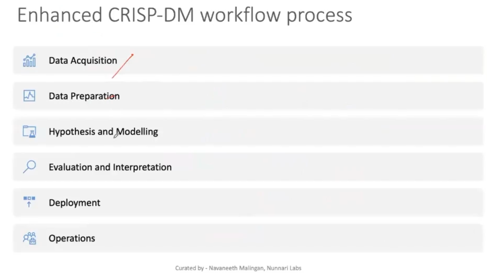

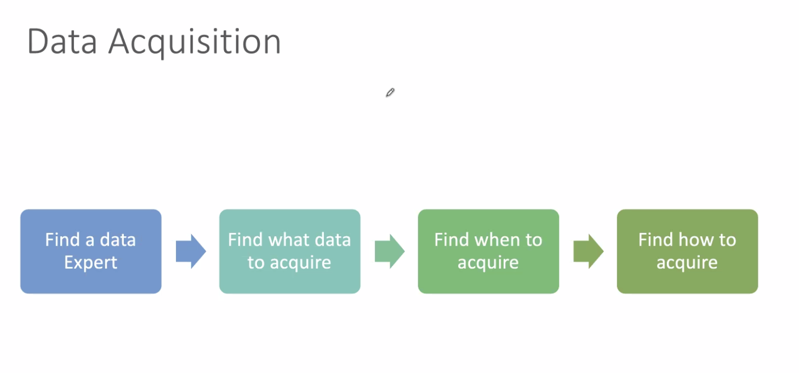

- retrospective analysis

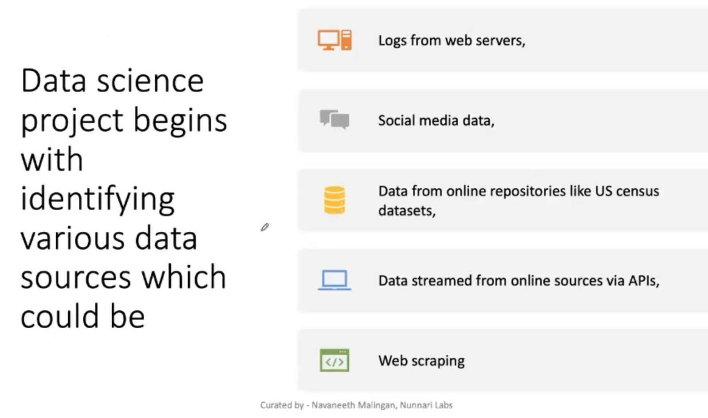

- kafka clusters

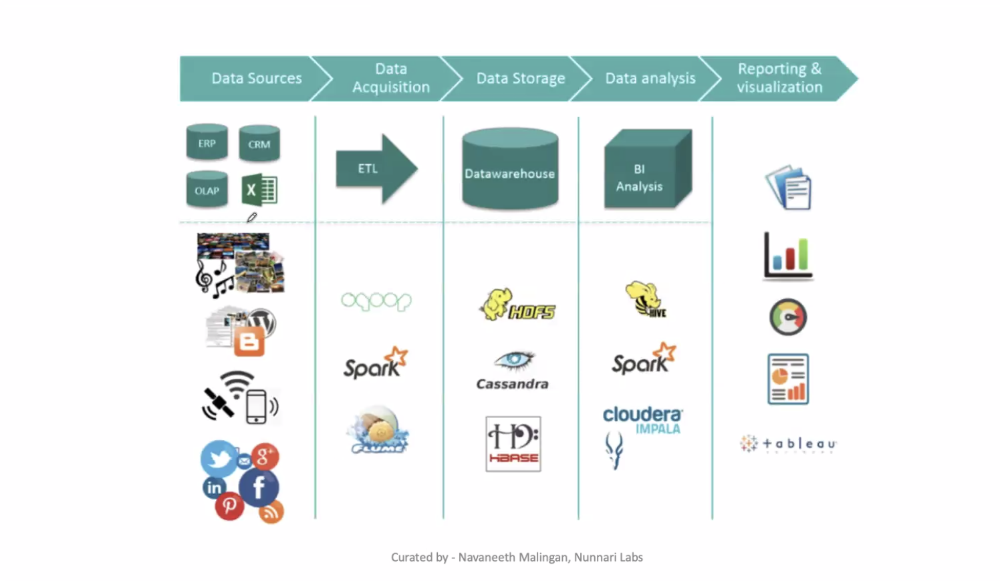

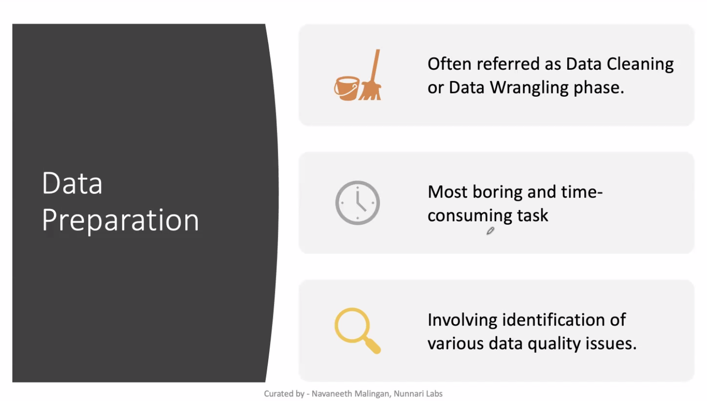

- scripts to collect data

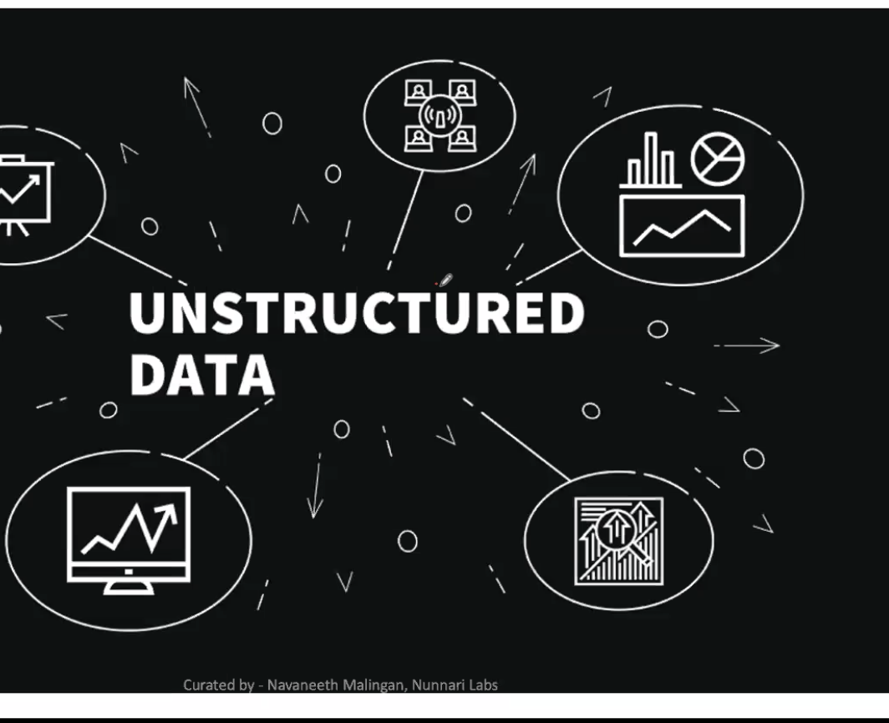

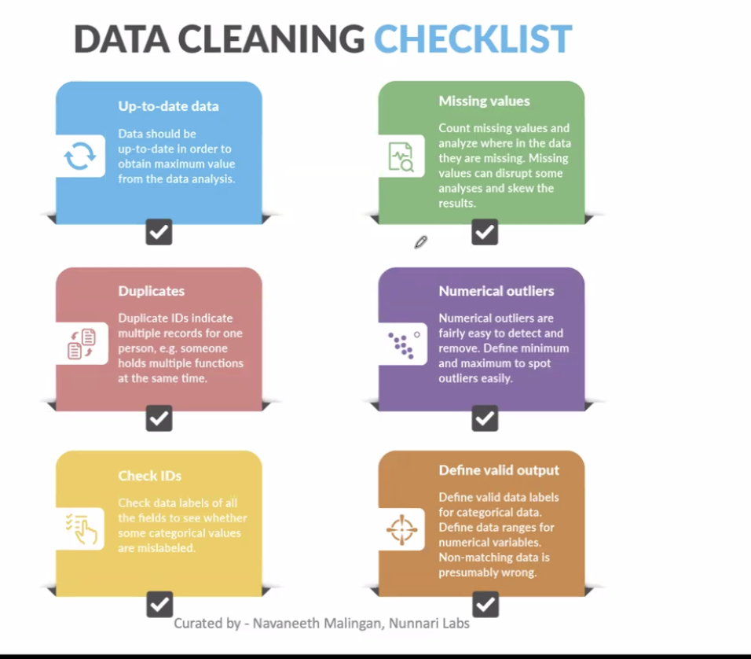

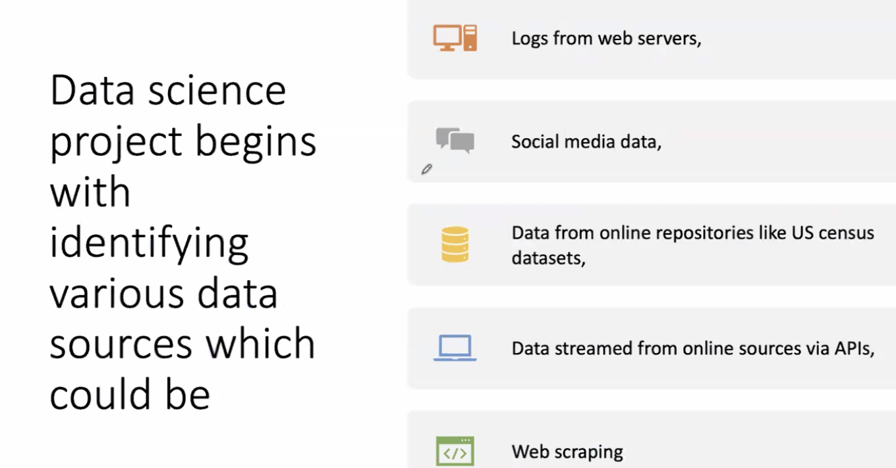

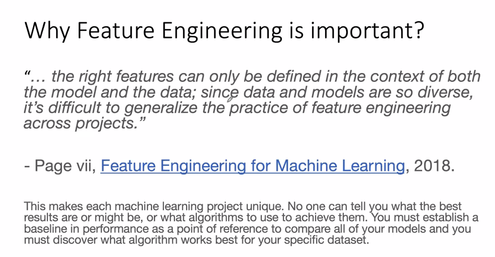
- need to transform the data to the required format for the model
    - there can be int columns,
- feature engg convert raw data to cleaned
- linear regression expects data to be in the form of matrix
    - so we need to convert the data to matrix form
    - this is called feature engg
    - this is done in the 4th phase of the crisp dm framework
- decision tree expects data to be in the form of tree
    - so we need to convert the data to tree form
    - this is called feature engg
    - this is done in the 4th phase of the crisp dm framework
    - its has no problem with categorical data(non linear data)
    - KNN depends on euclidean distance
        - so we need to normalize the data
    - in decision tree 
        - we dont need to worry about the scaling
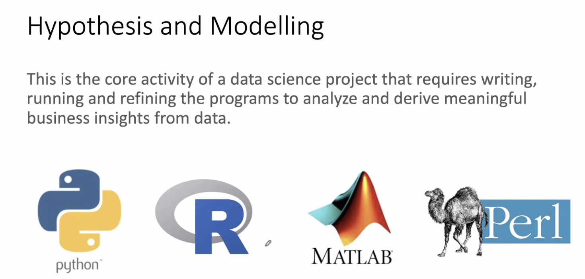

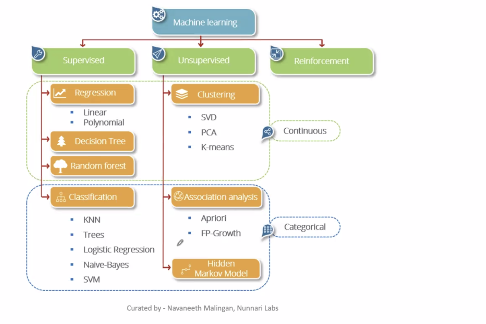

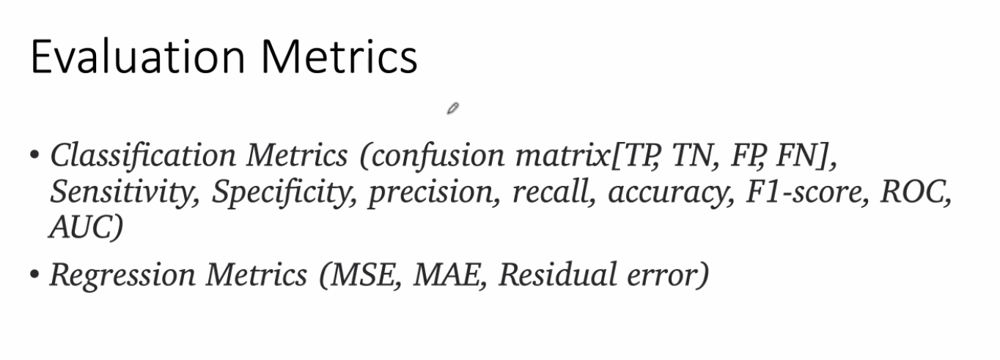

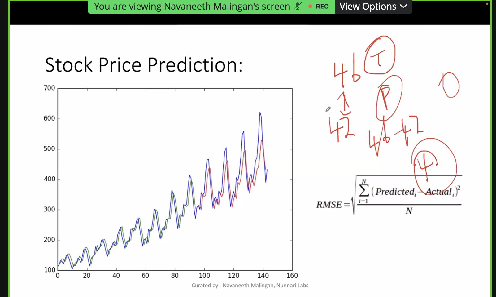