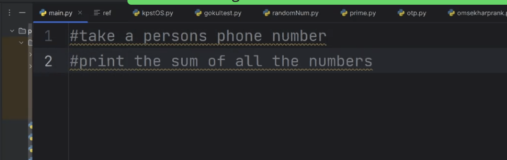

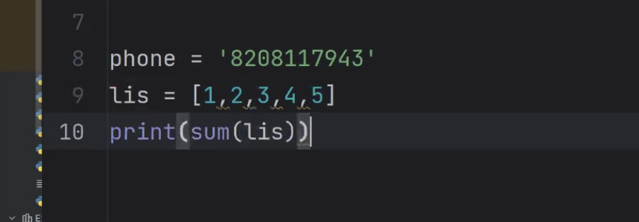

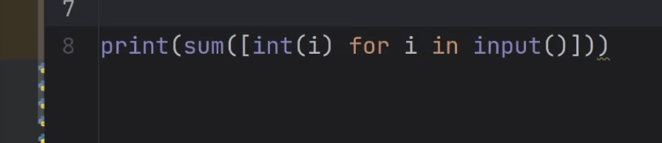

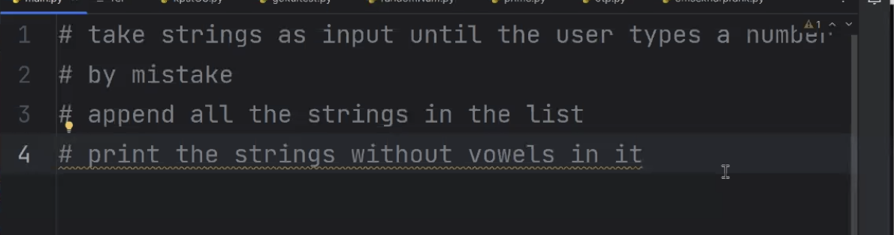

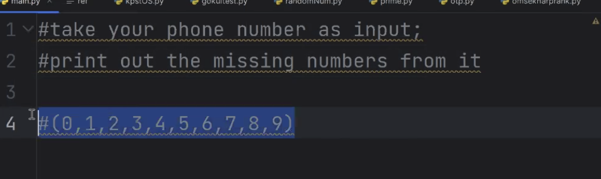

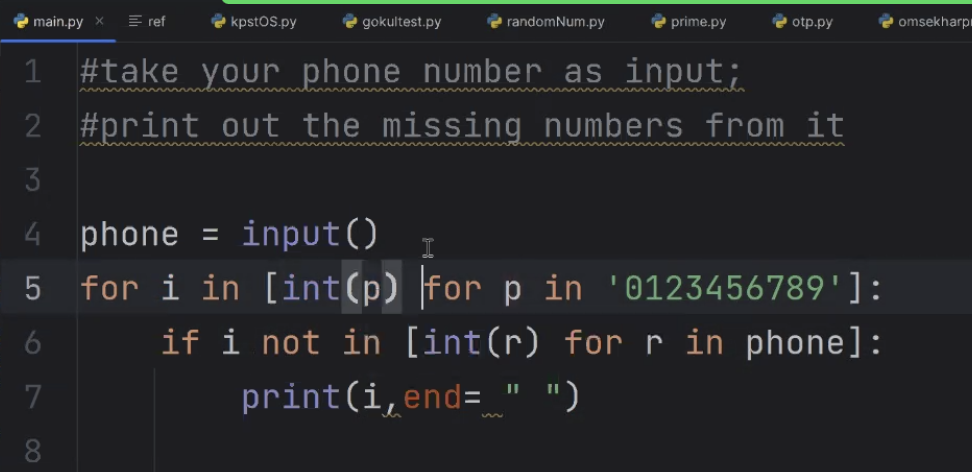

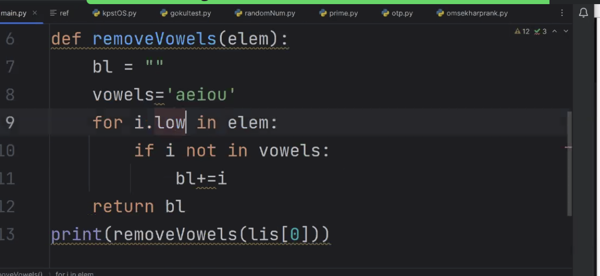

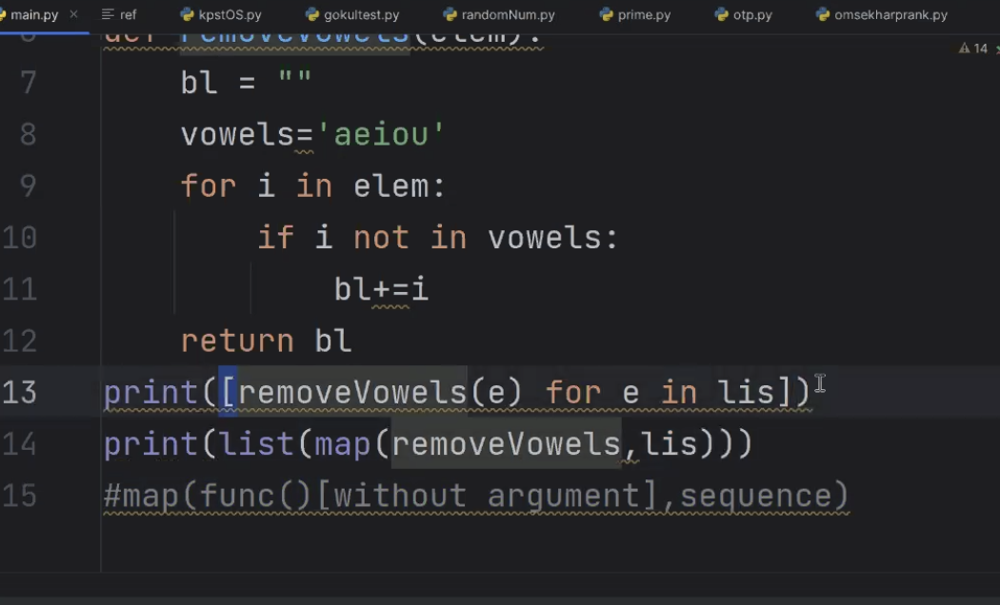

https://www.w3schools.com/python/ref_func_map.asp

https://www.w3schools.com/python/ref_func_filter.asp

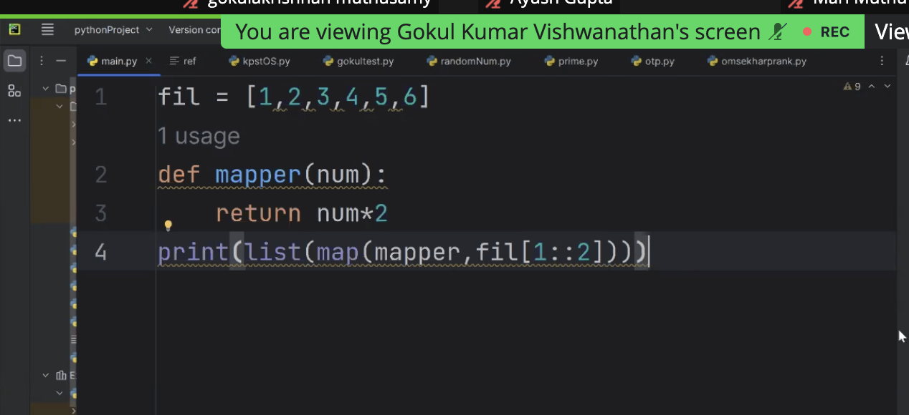

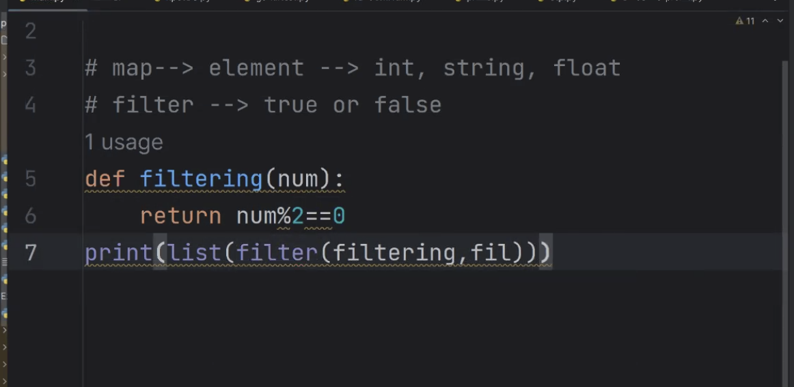

- difference between map and filter

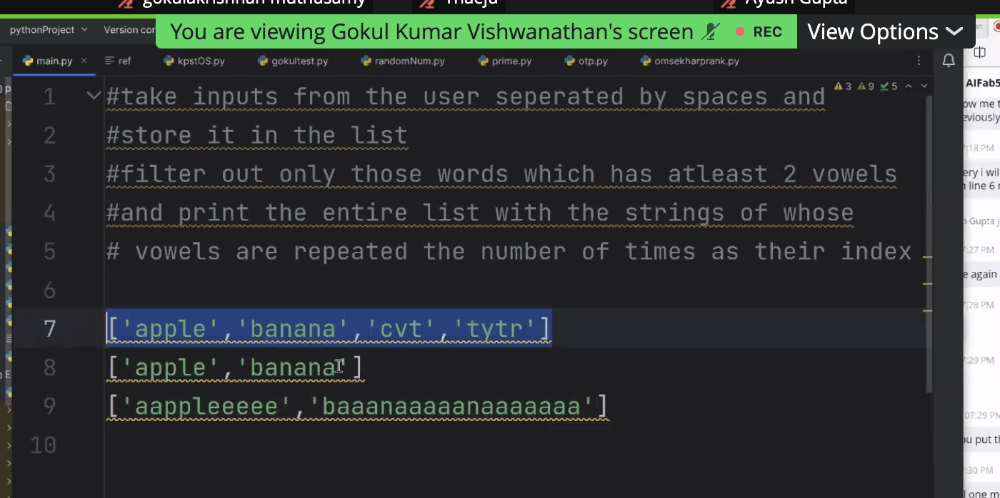

```
#take inputs from the user seperated by spaces and #store it in the list #filter out only those words which has atleast 2 vowels #and print the entire list with the strings of whose # vowels are repeated the number of times as their index+1 ['apple','banana','cvt','tytr'] ['apple','banana'] ['aappleeeeee','baaanaaaaanaaaaaaa']
```
```
# x=input().split()
x="apple banana cvt tytrabe"
def filter_vowel(x):
    y=0
    for i in x:
        if i in "aeiouAEIOU":
            y+=1
    return y>=2

filtered_list=list(filter(filter_vowel,x.split()))


def vovel_inc(x):
    y=""
    for i in range(len(x)):
        if x[i] in "aeiouAEIOU":
            y+=x[i]+x[i]*(i+1)
        else:
            y+=x[i]
    return y

print(filtered_list)
print(list(map(vovel_inc,filtered_list)))


```