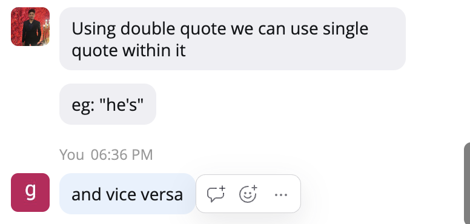
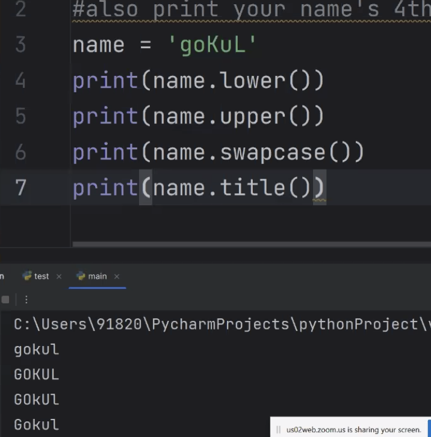

# Python programming

- proficiency matters

- high level -> human understandable or readable language
- low level language -> machine understandable and not human readable 
- java is a high level language but not as high as python

- we can use python in blender,
- sculpturing in blender is done in python
- we can use python in maya
- we can use python in unreal engine, and also do animation in unreal engine

- formatted string dont need to use + to concatenate strings and its not required to convert int to string
- we can use f before the string to make it formatted string
    - name, age = "sachin", 24
    - f"hello {name} {age}"

